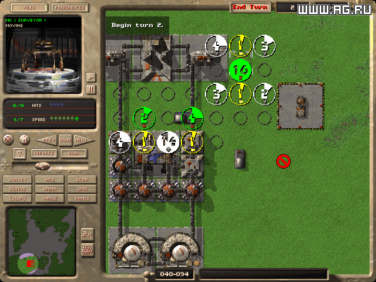

Language: [**en**|[ru](README.ru.md)]

# M.A.X. Reverse engineering

This project aims to accurately recreate the legendary game [M.A.X.](https://www.mobygames.com/game/max-mechanized-assault-exploration)
from existing binary files.





## Work plan

### Disassembling

At the first stage, the game will be disassembled in C#,
and a minimal environment will be created for its emulation:
x86 processor and dos environment.

The main thing is to achieve at least some work of the game.
And try to get the most disassembled C# source code for future use.

### Refactoring

Further, at the second stage, it is necessary to deeply refactor the resulting code and get neatly written M.A.X.

### Dreams

The third, final stage opens up unlimited scope for creativity.
It is possible to make a browser version of the game. And the version for mobile devices.

## Current state

Completed basic disassembly of game code in C#.

The game starts, the intro video is disabled.
The screen is displayed on a web page in a browser.
Mouse events from the browser are passed back to the game.
Thus, at the moment it is possible to fully play M.A.X.

The game code is as follows:

```C#
        [MethodInfo("0x1016_6130-63cf5e5f")]
        public void sys_strcasecmp()
        {
            ii(0x1016_6130, 1); push(ebx);                              /* push ebx */
            ii(0x1016_6131, 1); push(ecx);                              /* push ecx */
            ii(0x1016_6132, 2); mov(ebx, eax);                          /* mov ebx, eax */
        l_0x1016_6134:
            ii(0x1016_6134, 2); mov(al, memb[ds, ebx]);                 /* mov al, [ebx] */
            ii(0x1016_6136, 2); xor(ecx, ecx);                          /* xor ecx, ecx */
            ii(0x1016_6138, 2); mov(ah, memb[ds, edx]);                 /* mov ah, [edx] */
            ii(0x1016_613a, 2); mov(cl, al);                            /* mov cl, al */
            ii(0x1016_613c, 3); cmp(ecx, 0x41);                         /* cmp ecx, 0x41 */
            ii(0x1016_613f, 2); if(jl(0x1016_6148, 0x7)) goto l_0x1016_6148; /* jl 0x10166148 */
            ii(0x1016_6141, 3); cmp(ecx, 0x5a);                         /* cmp ecx, 0x5a */
            ii(0x1016_6144, 2); if(jg(0x1016_6148, 0x2)) goto l_0x1016_6148; /* jg 0x10166148 */
            ii(0x1016_6146, 2); add(al, 0x20);                          /* add al, 0x20 */

            ...

            ii(0x1016_6174, 1); pop(ecx);                               /* pop ecx */
            ii(0x1016_6175, 1); pop(ebx);                               /* pop ebx */
            ii(0x1016_6176, 1); ret();                                  /* ret */
        }
```

## Running on the local computer

1. Create the file `source\MikhailKhalizev.Max\settings\appsettings.user.json`:

```json
    {
      "Program": {
        "WorkingDirectory": "Path to folder <M.A.X. En Orig With Patch 1.04>" // For example: "C:\\Users\\user-name\\Documents\\MAX\\M.A.X. En Orig With Patch 1.04"
      }
    }
```

2. Run:

```
    cd source\MikhailKhalizev.Max
    dotnet run -c Release
```

3. Open a browser page https://localhost:5001.