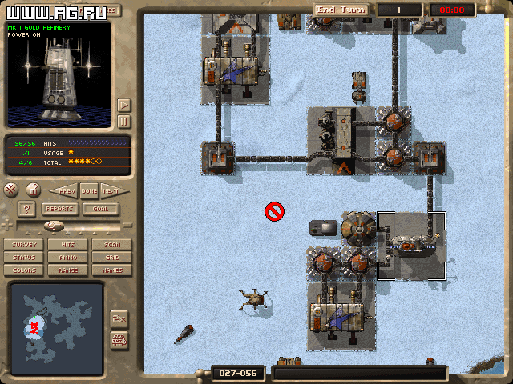
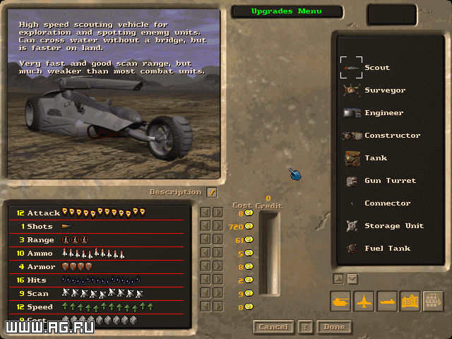
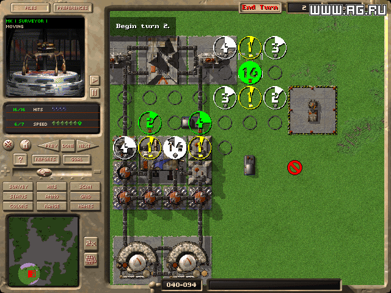
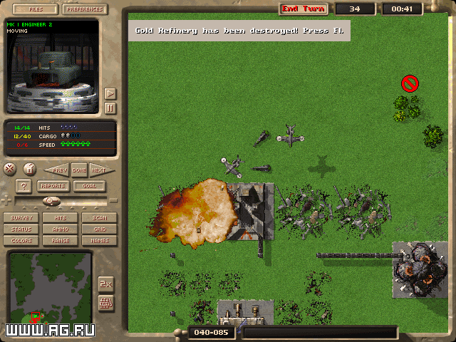

Язык: [[en](README.md)|**ru**]

# M.A.X. Reverse Engineering

Этот проект ставит цель в точности воссоздать легендарную игру [M.A.X.](https://www.mobygames.com/game/max-mechanized-assault-exploration) из имеющихся бинарных файлов.







## План работ

### Дизассемблирование

На первом этапе игра будет дизассемблирована в C#, и создано минимальное окружение для её эмуляции: процессор x86 и dos окружение.

Главное добиться хоть какой-нибудь работы игры.
И постараться получить наиболее приятный для использования в будущем дизассемблированный исходный код на С#.

### Рефакторинг

Далее, на втором этапе необходимо произвести глубокий рефакторинг получившегося кода и получить аккуратно написанный код ядра игры М.А.X.

### Мечты

Третий, заключительный этап открывает неограниченный простор для творчества.
Возможно сделать браузерную версию игры.
И версию для мобильных устройств.

## Текущее состояние

Завершено базовое дизассемблирование кода игры в C#.

Игра запускается, вступительное видео отключено.
Отображение экрана происходит на web-странице в браузере.
События мыши из браузера передаются обратно в игру.
Таким образом на данный момент возможно полноценно играть в M.A.X.

Код игры выглядит следующим образом:

```C#
        [MethodInfo("0x1016_6130-63cf5e5f")]
        public void sys_strcasecmp()
        {
            ii(0x1016_6130, 1); push(ebx);                              /* push ebx */
            ii(0x1016_6131, 1); push(ecx);                              /* push ecx */
            ii(0x1016_6132, 2); mov(ebx, eax);                          /* mov ebx, eax */
        l_0x1016_6134:
            ii(0x1016_6134, 2); mov(al, memb[ds, ebx]);                 /* mov al, [ebx] */
            ii(0x1016_6136, 2); xor(ecx, ecx);                          /* xor ecx, ecx */
            ii(0x1016_6138, 2); mov(ah, memb[ds, edx]);                 /* mov ah, [edx] */
            ii(0x1016_613a, 2); mov(cl, al);                            /* mov cl, al */
            ii(0x1016_613c, 3); cmp(ecx, 0x41);                         /* cmp ecx, 0x41 */
            ii(0x1016_613f, 2); if(jl(0x1016_6148, 0x7)) goto l_0x1016_6148; /* jl 0x10166148 */
            ii(0x1016_6141, 3); cmp(ecx, 0x5a);                         /* cmp ecx, 0x5a */
            ii(0x1016_6144, 2); if(jg(0x1016_6148, 0x2)) goto l_0x1016_6148; /* jg 0x10166148 */
            ii(0x1016_6146, 2); add(al, 0x20);                          /* add al, 0x20 */

            ...

            ii(0x1016_6174, 1); pop(ecx);                               /* pop ecx */
            ii(0x1016_6175, 1); pop(ebx);                               /* pop ebx */
            ii(0x1016_6176, 1); ret();                                  /* ret */
        }
```

## Запуск на локальном компьютере

1. Создайте файл `source\MikhailKhalizev.Max\settings\appsettings.user.json`:

```json
    {
      "Max": {
        "InstalledPath": "Путь к папке <M.A.X. En Orig With Patch 1.04>"
      }
    }
```

2. Запустите:

```
    cd source\MikhailKhalizev.Max
    dotnet run -c Release
```

3. Откройте  в браузере страницу https://localhost:5001.

# Ключевые слова

* interplay
* max
* x86
* disassembler
* dos
* game 
* x86 to c# converter